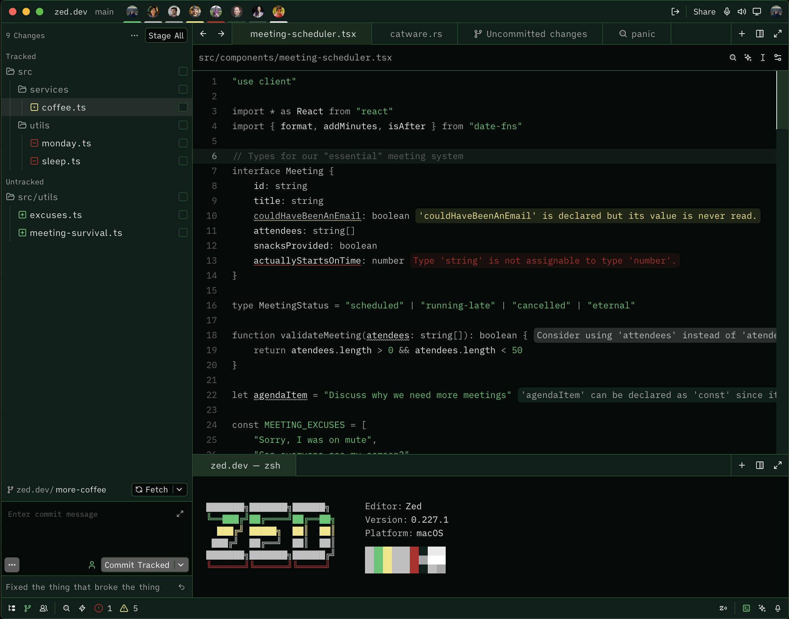

## Preview

## Usage

1. Open Zed.
2. Open the command palette (<kbd>Cmd</kbd>+<kbd>Shift</kbd>+<kbd>P</kbd>) and enter _zed: extensions_.
3. Search for the _Superior Green_ extension and install.
4. Enter _theme selector: toggle_ in the command palette and select the Superior Green theme in the dropdown.

### Publishing to the Marketplace

See the [Zed documentation](https://zed.dev/docs/extensions/developing-extensions#updating-an-extension) for more information.
